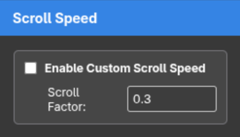

# Chrome Scroll Speed

Chrome extension which can change the scrolling speed of the mouse wheel.

Based on [gblazex/smoothscroll](https://github.com/gblazex/smoothscroll).

-----

Project forked from [DemonTPx/chrome-scroll-speed](https://github.com/DemonTPx/chrome-scroll-speed)

Changes:

* Added enable/disable toggle (improves usability)
* Improved settings UI

  

